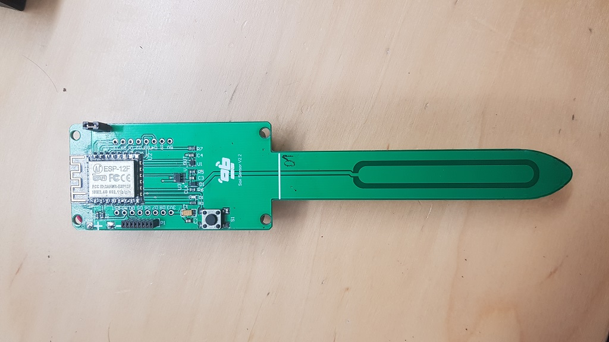
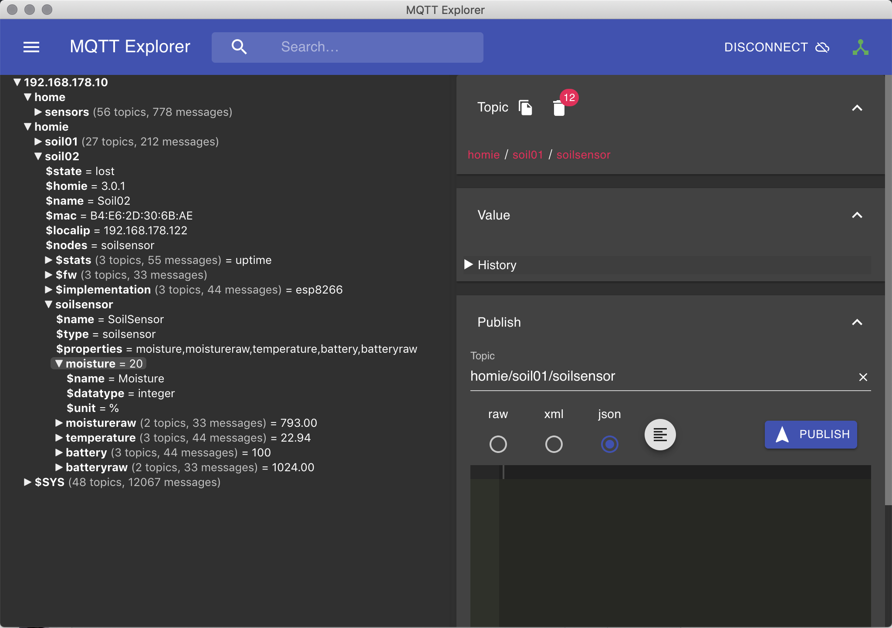

# esp-soil-moisture-sensor
[](https://github.com/MoJo2600/esp-soil-moisture-sensor/releases) [](https://platformio.org/lib/show/555/Homie) [](https://github.com/homieiot/homie-esp8266)

This repository contains code to use the [Homie](https://homieiot.github.io/homie-esp8266/docs/develop-v3/quickstart/what-is-it/) framework and its IoT convention with a soil moisture sensor from [April Brothers](https://wiki.aprbrother.com/en/ESP_Soil_Moisture_Sensor.html) (Source and schematic: https://github.com/AprilBrother/esp-soil-moisture-sensor). When this firmware is running, the sensor will publish it's sensor readings in the homie [convention format](https://homieiot.github.io/specification/spec-core-v2_0_1/). Based on the work of ve2cuz - [Real Drouin](https://www.qsl.net/v/ve2cuz//garden/)



The following properties are published:

|Property      | Description               |
|---           |---                        |
|moisture      | Soil moisture in percent |
|moistureraw   | Raw sensor reading (for debugging)  |
|temperature   | Temperature in °C |
|battery       | Battery level in percent |
|batteryraw    | Raw sensor reading (for debugging) |

## TL;DR

To use this firmware on your sensor follow the following steps:

* Grab the latest [release binary](https://github.com/MoJo2600/esp-soil-moisture-sensor/releases)
* Remove the jumper from the board
* [Open the configuration website](http://setup.homie-esp8266.marvinroger.fr/)
* Connect the flasher and write the firmware to your device
   ```
   esptool -cd nodemcu -cb 115200 -cp "/dev/ttyUSB0" -cf firmware.bin
   ```
* Remove the flasher
* Insert batteries
* Connect to the new Wifi (homie-123456)
* Open the configuration website, the device is found and you can follow the configuration process
* Remove the batteries
* Add Jumper to enable deep sleep
* Insert batteries again
* You can then subscribe to the topic homie/# on your MQTT broker and you will see the incoming messages


## Developing

### How to flash and configure
This code uses [PlatformIO](https://platformio.org/) for easy compilation and uploading. Just open PlatformIO and open the source folder and click on build. PlatformIO will download all necessary libraries and installs them for you.

#### Flashing

1. Set the Jumper to the open position
2. Connect programmer
3. Build and upload

### Configuring

* First, open the Homie [configuration website](http://setup.homie-esp8266.marvinroger.fr/). 
* After flashing, the device will open a wifi access point with a name like `homie-1234567`. Connect to this wifi.
* The configuration website will automatically detect the new homie device. Follow the setup procedure. If you plan to integrate the device into Openhab i suggest to leave the base MQTT topic to the default value `homie`.
* The device will restart and connect to your wifi and immediately start sending to the specified MQTT broker.
* Close the jumper to enable deep sleep
* Power cycle the the device. Otherwise it will stop after the first transmission and not got to deep sleep.

### Debugging

More to come

## Adding the device to openhab2

More to come
