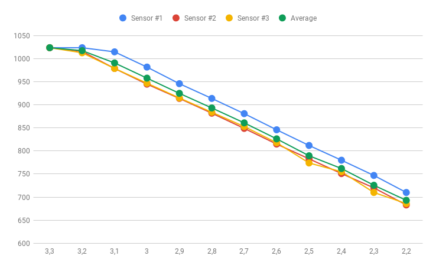
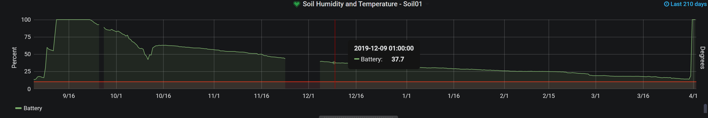
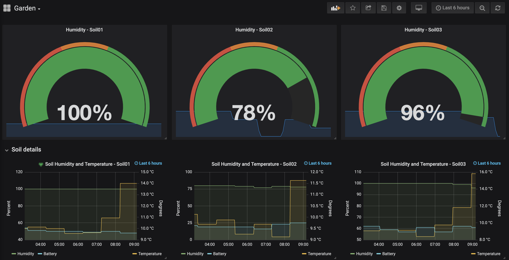

# esp-soil-moisture-sensor
[](https://github.com/MoJo2600/esp-soil-moisture-sensor/releases) [](https://platformio.org/lib/show/555/Homie) [](https://github.com/homieiot/homie-esp8266)

This repository contains code to use the [Homie](https://homieiot.github.io/homie-esp8266/docs/develop-v3/quickstart/what-is-it/) framework and its IoT convention with a soil moisture sensor from [April Brothers](https://wiki.aprbrother.com/en/ESP_Soil_Moisture_Sensor.html) (Source and schematic: https://github.com/AprilBrother/esp-soil-moisture-sensor). When this firmware is running, the sensor will publish it's sensor readings in the homie [convention format](https://homieiot.github.io/specification/spec-core-v2_0_1/). Based on the work of ve2cuz - [Real Drouin](https://www.qsl.net/v/ve2cuz//garden/)


The following properties are published:

|Property      | Description               |
|---           |---                        |
|moisture      | Soil moisture in percent |
|moistureraw   | Raw sensor reading (for debugging)  |
|temperature   | Temperature in °C |
|battery       | Battery level in percent |
|batteryraw    | Raw sensor reading (for debugging) |

The following settings can be changed

|Property            | Description                          |
|---                 |---                                   |
|useLED              | Use the LED to indicate status. Good for debugging, bad for battery life (Default: false)            |
|vccReading3V        | RAW reading of the ADC for 3V (Default: 958) See [here](#A-word-about-precision) for details          |
|moistWetReadingAt3V | RAW reading for 100% wet sensor at 3V (Default: 727) See [here](#A-word-about-precision) for details  |
|moistDryReadingAt3V | RAW reading for 100% dry sensor at 3V (Default: 540) See [here](#A-word-about-precision) for details  |

## TL;DR

To use this firmware on your sensor follow the following steps:

* Grab the latest [release binary](https://github.com/MoJo2600/esp-soil-moisture-sensor/releases)
* Remove the jumper from the board
* [Open the configuration website](http://setup.homie-esp8266.marvinroger.fr/)
* Connect the flasher and write the firmware to your device
   ```
   esptool -cd nodemcu -cb 115200 -cp "/dev/ttyUSB0" -cf firmware.bin
   ```
* Remove the flasher
* Insert batteries
* Connect to the new Wifi (homie-123456)
* Open the configuration website, the device is found and you can follow the configuration process. If you want to enable OTA updates, check the checkbox OTA.
* Remove the batteries
* Add Jumper to enable deep sleep
* Insert batteries again
* You can then subscribe to the topic homie/# on your MQTT broker and you will see the incoming messages


## A word about precision

The sensor has imho a design flaw. There is no voltage regulator implemented and VCC of the ES8266 is the
battery voltage. As VCC is the reference voltage of the ADC on the chip, the values depend on the battery
voltage. To get useful results we will need to apply some form of correction for the values read. Second 
thing that comes to play is, that values of the resistors of the voltage divider are not 100% the same
on different sensors. I have three sensors at hand and did some testing.

### Battery voltage measurements

I measured different supply voltages on all of my sensors and as you can see, the results differ noticeably.

| Voltage          | Sensor #1 | Sensor #2 | Sensor #3 | Average | Average linear |
|------------------|----------:|----------:|----------:|--------:|---------------:|
| 3,3              | 1024      | 1024      | 1024      | 1024    | 1024           |
| 3,2              | 1024      | 1016      | 1013      | 1018    | 1024           |
| 3,1              | 1015      | 979       | 979       | 991     | 991            |
| 3                | 982       | 945       | 947       | 958     | 958            |
| 2,9              | 946       | 914       | 915       | 925     | 925            |
| 2,8              | 914       | 882       | 884       | 893     | 892            |
| 2,7              | 881       | 849       | 853       | 861     | 859            |
| 2,6              | 846       | 815       | 818       | 826     | 825            |
| 2,5              | 812       | 783       | 774       | 790     | 792            |
| 2,4              | 780       | 751       | 755       | 762     | 759            |
| 2,3              | 747       | 720       | 710       | 726     | 726            |
| 2,2              | 710       | 683       | 686       | 693     | 693            |
| **Range 3V to 2,5V** | **170**       | **162**       | **173**       | **168**     | **166**            |



As you can see, the readings are pretty linear, but the differences are significant. The
tests showed, that the sensor stops working realiable below 2.5V.

### Moisture sensor measurements

Next test was to measure the moisture sensor at its nominal voltage 3V and 2.5V.

| @3.0V     | Moist 100% | Moist   0% | Corrected 100% | Corrected 0% |
|-----------|-----------:|-----------:|---------------:|-------------:|
| Sensor #1 | 568        | 746        |                |              |
| Sensor #2 | 505        | 712        |                |              |
| Sensor #3 | 546        | 724        |                |              |
| **Avg**   | **540**    | **727**    | **540**        | **727**      |

| @2.5V     | Moist 100% | Moist   0% | Corrected 100% | Corrected 0% |
|-----------|-----------:|-----------:|---------------:|-------------:|
| Sensor #1 | 469        | 610        | 567            | 738          |
| Sensor #1 | 412        | 580        | 497            | 700          |
| Sensor #3 | 448        | 589        | 548            | 721          |
| **Avg**   | **443**    | **593**    | **536**        | **717**      |

I implemented a simple correction method, that takes the change in battery voltage into
account. The values can be adjusted to your sensor, if you measure the values. The default
values i used are the average values i measured.

### Measuring and setting adjustment values

You will need to measure three values to adjust your sensor. Those have to be measured @3.0V VCC. Do not measure while using the programmer, because the programmer is working with 3.3V. You will get wrong results. The steps are very easy:

* Flash the firmware to your device configure it and connect to your MQTT broker
* Make sure the soil sensor is dry
* Connect it to a 3V power source and note down ```batteryraw``` and ```moistureraw``` published to the MQTT topic
* Submerge your sensor up to the marking in water and reconnect the 3V power source
* Note down the now published value of ```moistureraw```

You can now take the following JSON and publish it as a retained message to ```homie/YOURSENSORNAME/soilsensor/$implementation/config/set```

```
 {
  "settings": {
    "vccReading3V": YOUR_BATTERYRAW_VALUE,
    "moistWetReadingAt3V": YOUR_WET_MOISTURERAW_VALUE,
    "moistDryReadingAt3V": YOUR_DRY_MOISTURERAW_VALUE
  }
}
```

The next time the device goes online it will read this configuration and use the values from now on.

## What about Battery life?

One of my sensors was sitting indoors without measuring anything and the battery life was > 210 days on one set of regular AA batteries. You can see the graph here:



## OTA - Over the air update

You don't need to collect all your devices and connect a programmer to do a firmware upgrade. You can use the provided
script in `scripts` to schedule a update. Just compile your new firmware file and execute the script with the parameters
matching you setup and devicenames. You have to enable OTA Updates during configuration (You can always patch the
configuration like it is described [here](#A-word-about-precision))

```
cd scripts/
./otaupdate.sh 192.168.178.10 soil01
```

The next time the device wakes up, it will check for a new firmware and update itself.

## Developing

### How to flash and configure
This code uses [PlatformIO](https://platformio.org/) for easy compilation and uploading. Just open PlatformIO and open the source folder and click on build. PlatformIO will download all necessary libraries and installs them for you.

#### Flashing

1. Set the Jumper to the open position
2. Connect programmer
3. Build and upload

### Configuring

* First, open the Homie [configuration website](http://setup.homie-esp8266.marvinroger.fr/). 
* After flashing, the device will open a wifi access point with a name like `homie-1234567`. Connect to this wifi.
* The configuration website will automatically detect the new homie device. Follow the setup procedure. If you plan to integrate the device into Openhab i suggest to leave the base MQTT topic to the default value `homie`.
* The device will restart and connect to your wifi and immediately start sending to the specified MQTT broker.
* Close the jumper to enable deep sleep
* Power cycle the the device. Otherwise it will stop after the first transmission and not got to deep sleep.

### Debugging

You can uncomment the `DEBUG` definition at the beginning of the code to enable a more informative log on the serial console.

## Adding the device to openhab2

The MQTT binding in OpenHAB2 natively supports homie devices. If you configure your broker, the devices will pop up in the in inbox in the PaperUI. You can then integrate them as you like. If you add persistence to influx to it, you can generate graphs with grafana.


